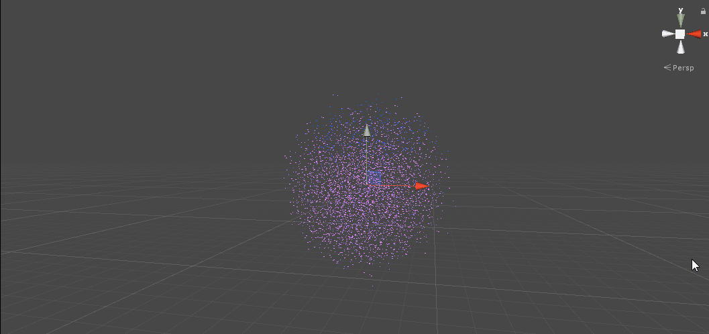

# ComputeShaderTest
 a project to test the usage of compute shader in unity

测试Compute Shader的一些用法

    
     

参考链接:

https://github.com/Shinao/Unity-GPU-Boids

https://forum.unity.com/threads/gpu-instances-with-shadows-how-possible.539062/

https://github.com/chenjd/Unity-Boids-Behavior-on-GPGPU
